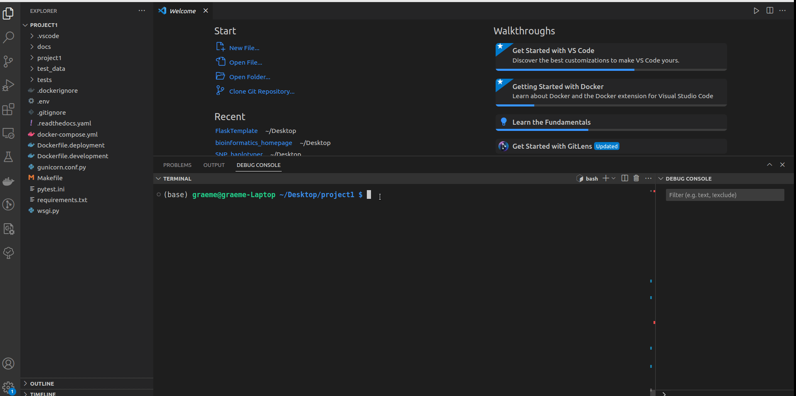
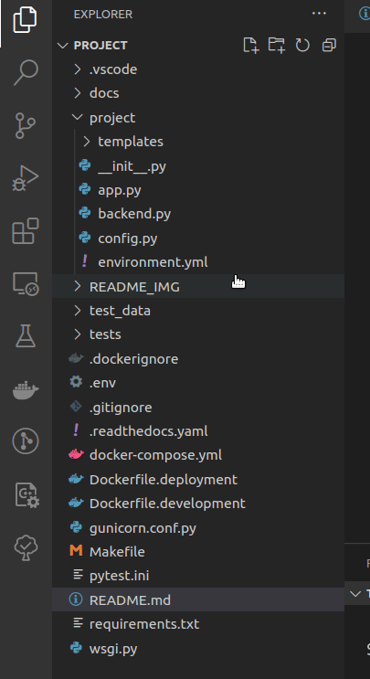

# dMLPA

## What does this app do?

## What are typical use cases for this script?

## How does this script work?

## Known Limitations of this Software

## Debugging with Visual Studio Code

To debug your Dockerized Flask application live using Visual Studio Code, follow these steps:

1. Start Dockerized Flask in Debug Mode with the command `docker-compose up --build` in the project folder:

   

2. Attach VS Code to Dockerized Flask App in Debug Mode by opening the debugger and launching `Python: Remote Attach` as shown below:

   

The Flask application will now be accessible at `http://localhost:5000/dMLPA`

## Compiling Sphinx Documentation

```bash
# From within the local repo run the following commands.

# Auto generate documentation from docstrings
sphinx-apidoc -f -o docs/apidocs snp_haplotyper/

# Build documentation from source files
(cd docs && make clean) # Optional - removes any cached html files
sphinx-build -b html docs/source docs/build
```

To view the output open index.html in the build folder.

## Compiling Sphinx Documentation

```bash
# From within the local repo run the following commands.

# Auto generate documentation from docstrings
sphinx-apidoc -f -o docs/apidocs snp_haplotyper/

# Build documentation from source files
(cd docs && make clean) # Optional - removes any cached html files
sphinx-build -b html docs/source docs/build
```

To view the output open index.html in the build folder.


## Contributing

If you find any issues or have suggestions for improvement, feel free to submit a pull request or open an issue in the project's repository.

## License

This project is licensed under the MIT License - see the [LICENSE](./LICENSE) file for details.

## Acknowledgements

Thank you to the authors and contributors of Flask, Cookiecutter, and other open-source libraries that made this template possible.
